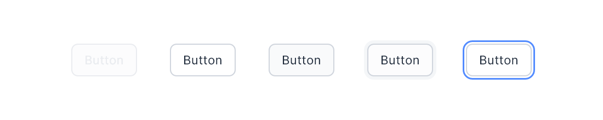
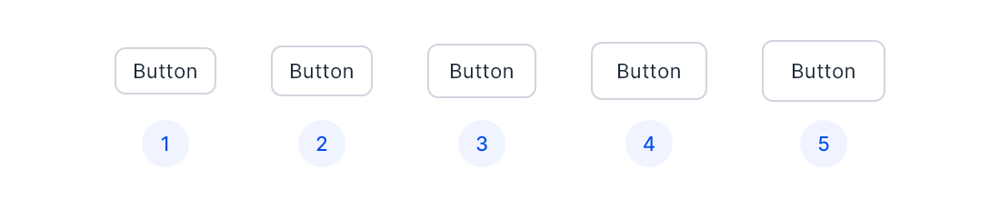

# Button
Buttons allow users to take actions, and make choices, with a single click.

----

## Usage
Buttons communicate actions that users can take. They are typically places throughout your UI, in places like:
- Dialogs
- Modal windows
- Forms
- Panels or Cards
- Toolbars

&nbsp;

## Live Component
[!embed el="iframe" height="120"](../static/html/components/button/button-secondary-showcase.html)
Interact with live button component. Button has scaled 1.2 times the actual size for better view. Button has following interaction:

| Interaction | Event |
| --- | --- |
| Rest | `None` |
| Hover | `Mouse Hover` |
| Active | `Mouse Click` |
| Focus | `Mouse Click` |
| Tab Focus | `KeyDown: Tab` |

&nbsp;

## Variants
----

| Number | Name | Description |
| --- | --- | --- |
| 1 | `Regular` | Contains only textual content |
| 2 | `WithIcon` | Contains icon and textual content. Has `left` and `right` icon placement option |
| 3 | `OnlyIcon` | Contains only icon |
| 4 | `Indicator` | Contains a colored indicator on left side and has textual content. Has option to place an icon to the right of the text |

&nbsp;

## Types
----

| Number | Name | Description |
| --- | --- | --- |
| 1 | `Primary` | For getting user's attention. There should be one primary action on the component or panel |
| 2 | `Secondary` | Mostly used in group buttons and tool bars. There can be more than one secondary action on the component or panel |
| 3 | `Highlight` | Used mainly in graphs and where action is not mandatory but important |
| 4 | `Tertiary` | To create a hierarchy in the group of actions. It shows that action is least important |

&nbsp;

## Specification

==+ :icon-dot: Size
----

Properties `height` and `padding` defines the Button size. Below is the defined list of size configuration which are commonly used.

**Note:** Padding is applied only horizontally and not vertically.

| Number | Name | Height | Padding |
| --- | --- | --- | --- |
| 1 | `sz-26` | `26px` | `10px` |
| 2 | `sz-28` | `28px` | `10px` |
| 3 (Default) | `sz-30` | `30px` | `12px` |
| 4 | `sz-32` | `32px` | `14px` |
| 5 | `sz-34` | `34px` | `16px` |

Button with `OnlyIcon` has no padding and `width` is same as it's height.

===
