# Colors
Petran Design interprets the color system into two categories: a primary colors and secondary colors.

The primary colors defines the specific design process, based on the color of the system to further define the tone of the product in accordance with the requirements and function of the color. The secondary colors mainly defines the basic color palette, neutral color palette and data visualization color palette.

----------

## Primary Colors
These are the main colors that make up the majority of the color used in the design system.

### Base
These are the base black and white color styles to quickly swap out if you need to.
--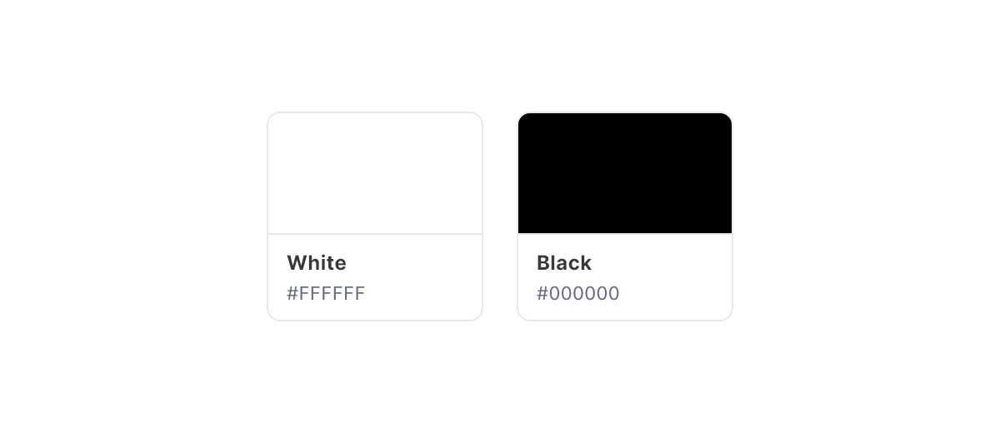--

| Variant | Color | Text Color |
| --- | --- | --- |
| White | `#FFFFFF` | `Gray/800` |
| Black | `#000000` | `Base/White` |

&nbsp;

### Gray
Gray is a neutral color and is the foundation of the color system. Almost everything in UI design — text, form fields, backgrounds, dividers — are usually gray.
--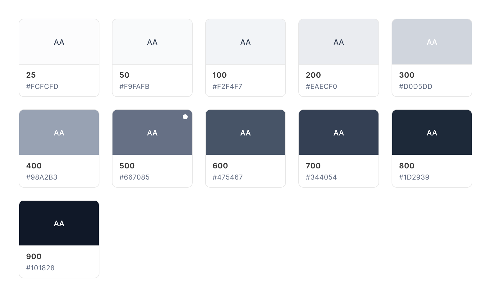--

| Variant | Color | Text Color |
| --- | --- | --- |
| 25 | `#FCFCFD` | `Gray/700` |
| 50 | `#F9FAFB` | `Gray/700` |
| 100 | `#F2F4F7` | `Gray/700` |
| 200 | `#EAECF0` | `Gray/700` |
| 300 | `#D0D5DD` | `Base/White` |
| 400 | `#98A2B3` | `Base/White` |
| 500 (Default) | `#667085` | `Base/White` |
| 600 | `#475467` | `Base/White` |
| 700 | `#344054` | `Base/White` |
| 800 | `#1D2939` | `Base/White` |
| 900 | `#101828` | `Base/White` |

&nbsp;

### Primary
The primary color defines the "brand" color, and is used across all interactive elements such as buttons, links, inputs, etc. This color can define the overall feel and can elicit emotion.
--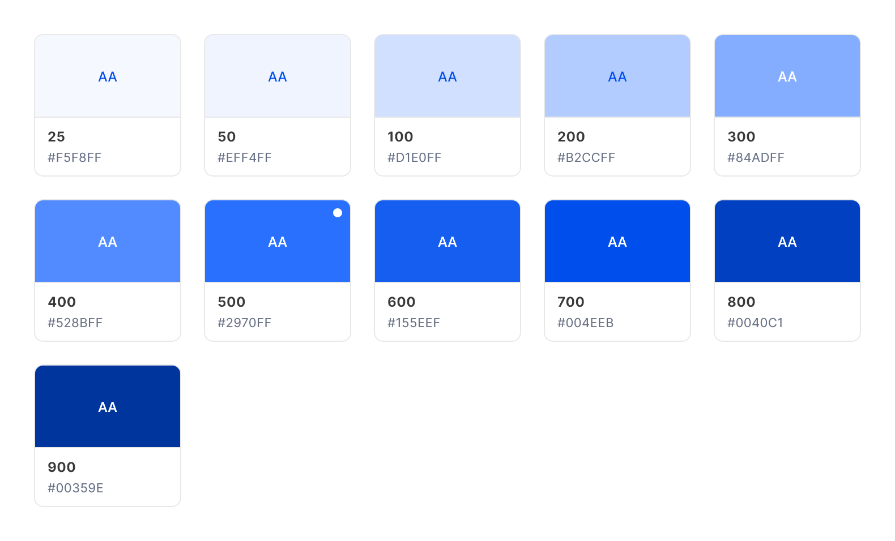--

| Variant | Color | Text Color |
| --- | --- | --- |
| 25 | `#F5F8FF` | `Primary/700` |
| 50 | `#EFF4FF` | `Primary/700` |
| 100 | `#D1E0FF` | `Primary/700` |
| 200 | `#B2CCFF` | `Primary/700` |
| 300 | `#84ADFF` | `Base/White` |
| 400 | `#528BFF` | `Base/White` |
| 500 (Default) | `#2970FF` | `Base/White` |
| 600 | `#155EEF` | `Base/White` |
| 700 | `#004EEB` | `Base/White` |
| 800 | `#0040C1` | `Base/White` |
| 900 | `#00359E` | `Base/White` |

&nbsp;

### Error
Error colors are used across error states and in destructive actions. They communicate a destructive/negative action, such as removing an asset from the list.
--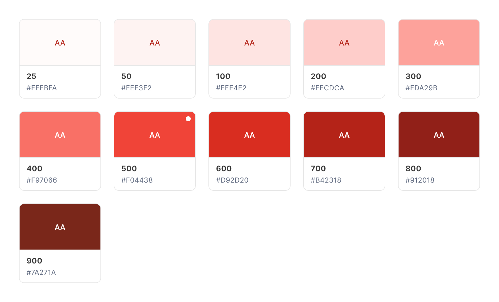--

| Variant | Color | Text Color |
| --- | --- | --- |
| 25 | `#FFFBFA` | `Error/700` |
| 50 | `#FEF3F2` | `Error/700` |
| 100 | `#FEE4E2` | `Error/700` |
| 200 | `#FECDCA` | `Error/700` |
| 300 | `#FDA29B` | `Base/White` |
| 400 | `#F97066` | `Base/White` |
| 500 (Default) | `#F04438` | `Base/White` |
| 600 | `#D92D20` | `Base/White` |
| 700 | `#B42318` | `Base/White` |
| 800 | `#912018` | `Base/White` |
| 900 | `#7A271A` | `Base/White` |

&nbsp;

### Warning
Warning colors can communicate that an action is potentially destructive or on-hold. These colors are commonly used in confirmations to grab the user's attention.
--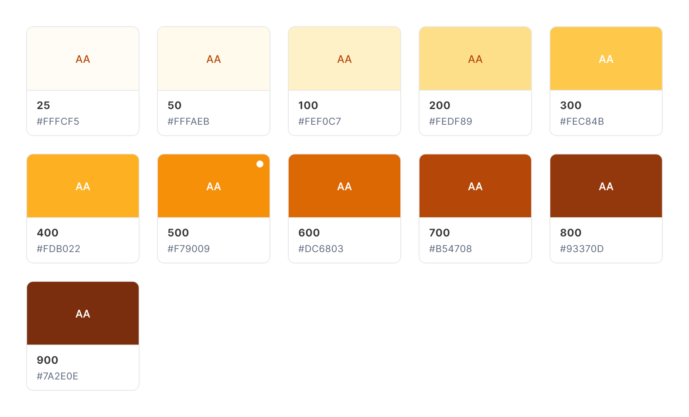--

| Variant | Color | Text Color |
| --- | --- | --- |
| 25 | `#FFFCF5` | `Warning/700` |
| 50 | `#FFFAEB` | `Warning/700` |
| 100 | `#FEF0C7` | `Warning/700` |
| 200 | `#FEDF89` | `Warning/700` |
| 300 | `#FEC84B` | `Base/White` |
| 400 | `#FDB022` | `Base/White` |
| 500 (Default) | `#F79009` | `Base/White` |
| 600 | `#DC6803` | `Base/White` |
| 700 | `#B54708` | `Base/White` |
| 800 | `#93370D` | `Base/White` |
| 900 | `#7A2E0E` | `Base/White` |

&nbsp;

### Success
Success colors communicate a positive action, positive trend, or a successful confirmation.
--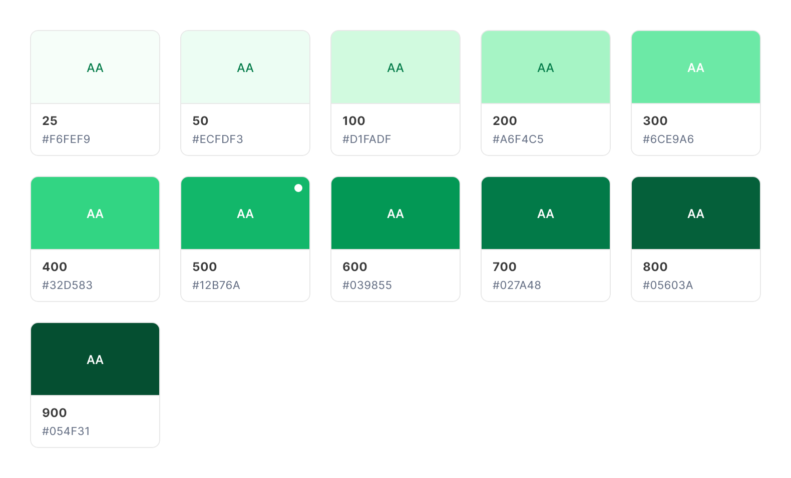--

| Variant | Color | Text Color |
| --- | --- | --- |
| 25 | `#F6FEF9` | `Success/700` |
| 50 | `#ECFDF3` | `Success/700` |
| 100 | `#D1FADF` | `Success/700` |
| 200 | `#A6F4C5` | `Success/700` |
| 300 | `#6CE9A6` | `Base/White` |
| 400 | `#32D583` | `Base/White` |
| 500 (Default) | `#12B76A` | `Base/White` |
| 600 | `#039855` | `Base/White` |
| 700 | `#027A48` | `Base/White` |
| 800 | `#05603A` | `Base/White` |
| 900 | `#054F31` | `Base/White` |

----------

## Secondary Colors
Along with primary colors, its helpful to have a selection of secondary colors to use in components such as pills, alerts and labels also in data visualization. These secondary colors should be used sparingly or as accents.

### Gray Blue
Can be swapped or used along with the primary gray color also in data visualization.
--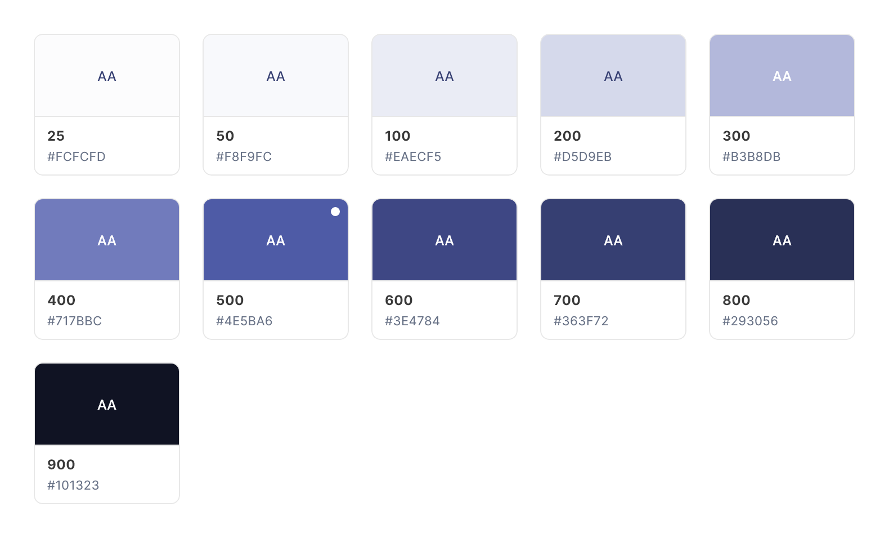--

| Variant | Color | Text Color |
| --- | --- | --- |
| 25 | `#FCFCFD` | `Gray Blue/700` |
| 50 | `#F8F9FC` | `Gray Blue/700` |
| 100 | `#EAECF5` | `Gray Blue/700` |
| 200 | `#D5D9EB` | `Gray Blue/700` |
| 300 | `#B3B8DB` | `Base/White` |
| 400 | `#717BBC` | `Base/White` |
| 500 (Default) | `#4E5BA6` | `Base/White` |
| 600 | `#3E4784` | `Base/White` |
| 700 | `#363F72` | `Base/White` |
| 800 | `#293056` | `Base/White` |
| 900 | `#101323` | `Base/White` |

&nbsp;

### Gray Modern
Can be swapped or used along with the primary gray color.
--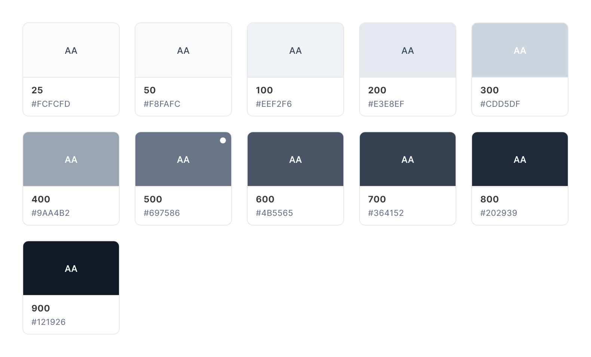--

| Variant | Color | Text Color |
| --- | --- | --- |
| 25 | `#FCFCFD` | `Gray Modern/700` |
| 50 | `#F8FAFC` | `Gray Modern/700` |
| 100 | `#EEF2F6` | `Gray Modern/700` |
| 200 | `#E3E8EF` | `Gray Modern/700` |
| 300 | `#CDD5DF` | `Base/White` |
| 400 | `#9AA4B2` | `Base/White` |
| 500 (Default) | `#697586` | `Base/White` |
| 600 | `#4B5565` | `Base/White` |
| 700 | `#364152` | `Base/White` |
| 800 | `#202939` | `Base/White` |
| 900 | `#121926` | `Base/White` |

&nbsp;

### Gray Warm
Can be used along with the primary gray color also in data visualization.
--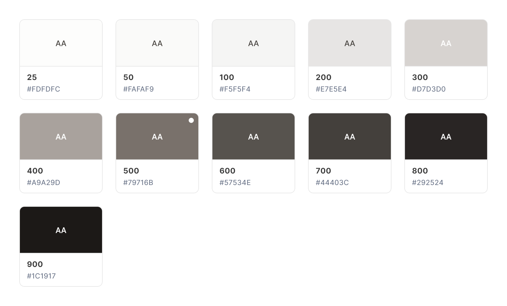--

| Variant | Color | Text Color |
| --- | --- | --- |
| 25 | `#FDFDFC` | `Gray Warm/700` |
| 50 | `#FAFAF9` | `Gray Warm/700` |
| 100 | `#F5F5F4` | `Gray Warm/700` |
| 200 | `#E7E5E4` | `Gray Warm/700` |
| 300 | `#D7D3D0` | `Base/White` |
| 400 | `#A9A29D` | `Base/White` |
| 500 (Default) | `#79716B` | `Base/White` |
| 600 | `#57534E` | `Base/White` |
| 700 | `#44403C` | `Base/White` |
| 800 | `#292524` | `Base/White` |
| 900 | `#1C1917` | `Base/White` |

&nbsp;

### Green
Can be used along with primary success color and in data visualization.
--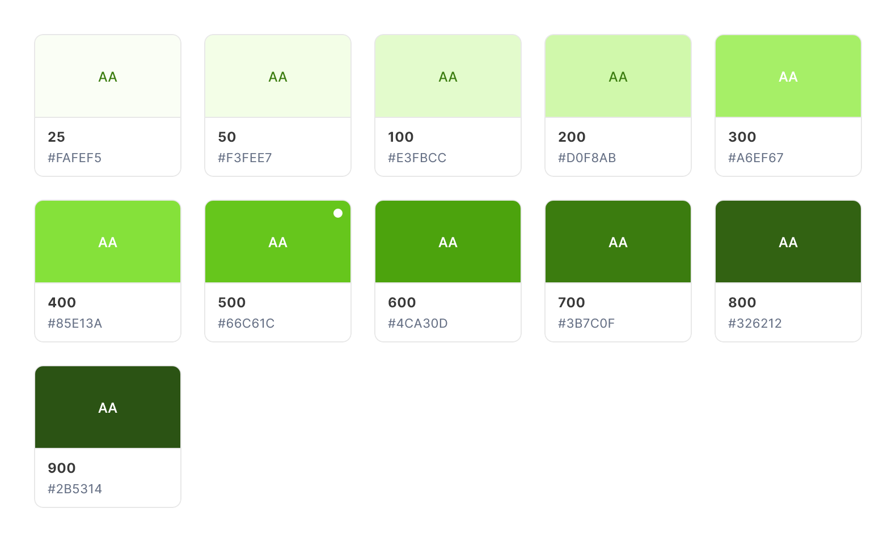--

| Variant | Color | Text Color |
| --- | --- | --- |
| 25 | `#FAFEF5` | `Green/700` |
| 50 | `#F3FEE7` | `Green/700` |
| 100 | `#E3FBCC` | `Green/700` |
| 200 | `#D0F8AB` | `Green/700` |
| 300 | `#A6EF67` | `Base/White` |
| 400 | `#85E13A` | `Base/White` |
| 500 (Default) | `#66C61C` | `Base/White` |
| 600 | `#4CA30D` | `Base/White` |
| 700 | `#3B7C0F` | `Base/White` |
| 800 | `#326212` | `Base/White` |
| 900 | `#2B5314` | `Base/White` |

&nbsp;

### Blue
Can be used along with primary color and in data visualization.
--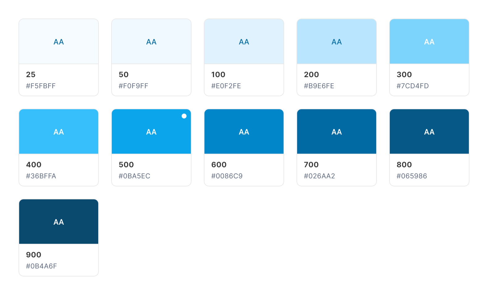--

| Variant | Color | Text Color |
| --- | --- | --- |
| 25 | `#F5FBFF` | `Blue/700` |
| 50 | `#F0F9FF` | `Blue/700` |
| 100 | `#E0F2FE` | `Blue/700` |
| 200 | `#B9E6FE` | `Blue/700` |
| 300 | `#7CD4FD` | `Base/White` |
| 400 | `#36BFFA` | `Base/White` |
| 500 (Default) | `#0BA5EC` | `Base/White` |
| 600 | `#0086C9` | `Base/White` |
| 700 | `#026AA2` | `Base/White` |
| 800 | `#065986` | `Base/White` |
| 900 | `#0B4A6F` | `Base/White` |

&nbsp;

### Purple
Can be used in data visualization and components states.
--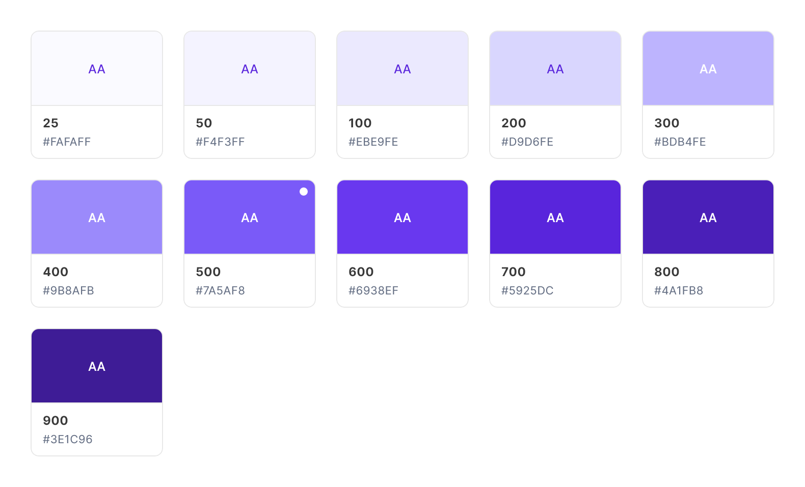--

| Variant | Color | Text Color |
| --- | --- | --- |
| 25 | `#FAFAFF` | `Purple/700` |
| 50 | `#F4F3FF` | `Purple/700` |
| 100 | `#EBE9FE` | `Purple/700` |
| 200 | `#D9D6FE` | `Purple/700` |
| 300 | `#BDB4FE` | `Base/White` |
| 400 | `#9B8AFB` | `Base/White` |
| 500 (Default) | `#7A5AF8` | `Base/White` |
| 600 | `#6938EF` | `Base/White` |
| 700 | `#5925DC` | `Base/White` |
| 800 | `#4A1FB8` | `Base/White` |
| 900 | `#3E1C96` | `Base/White` |

&nbsp;

### Pink
Can be swapped or used along with primary error color and also in data visualization.
--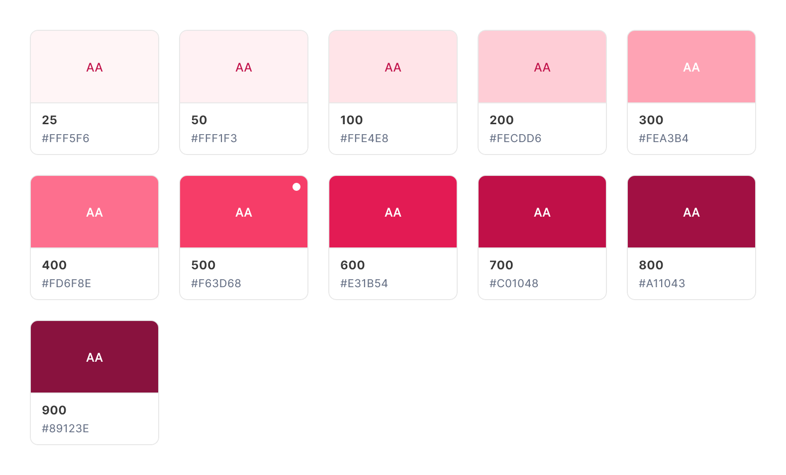--

| Variant | Color | Text Color |
| --- | --- | --- |
| 25 | `#FFF5F6` | `Pink/700` |
| 50 | `#FFF1F3` | `Pink/700` |
| 100 | `#FFE4E8` | `Pink/700` |
| 200 | `#FECDD6` | `Pink/700` |
| 300 | `#FEA3B4` | `Base/White` |
| 400 | `#FD6F8E` | `Base/White` |
| 500 (Default) | `#F63D68` | `Base/White` |
| 600 | `#E31B54` | `Base/White` |
| 700 | `#C01048` | `Base/White` |
| 800 | `#A11043` | `Base/White` |
| 900 | `#89123E` | `Base/White` |

&nbsp;

### Orange
Can be swapped or used along with primary warning color and also in data visualization.
--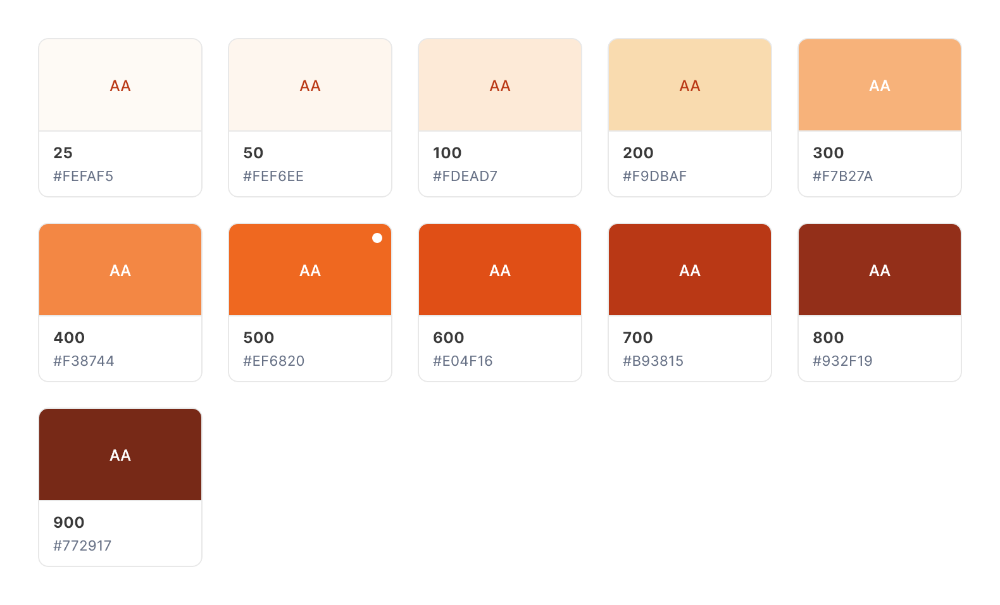--

| Variant | Color | Text Color |
| --- | --- | --- |
| 25 | `#FEFAF5` | `Orange/700` |
| 50 | `#FEF6EE` | `Orange/700` |
| 100 | `#FDEAD7` | `Orange/700` |
| 200 | `#F9DBAF` | `Orange/700` |
| 300 | `#F7B27A` | `Base/White` |
| 400 | `#F38744` | `Base/White` |
| 500 (Default) | `#EF6820` | `Base/White` |
| 600 | `#E04F16` | `Base/White` |
| 700 | `#B93815` | `Base/White` |
| 800 | `#932F19` | `Base/White` |
| 900 | `#772917` | `Base/White` |

&nbsp;
