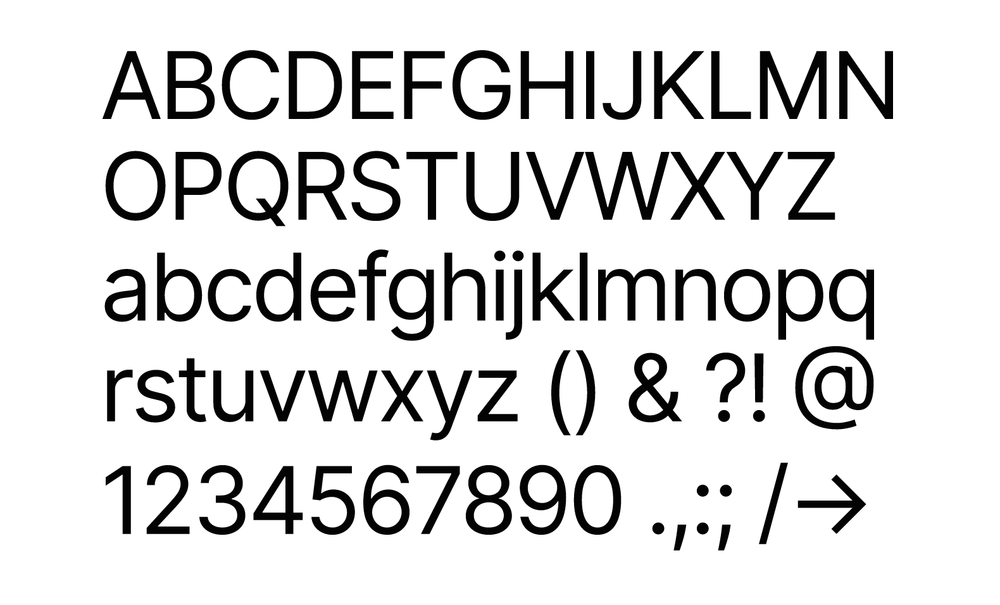
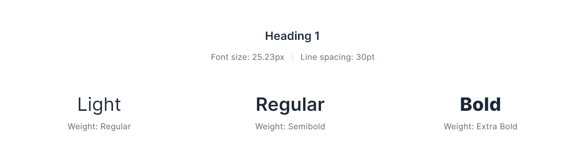
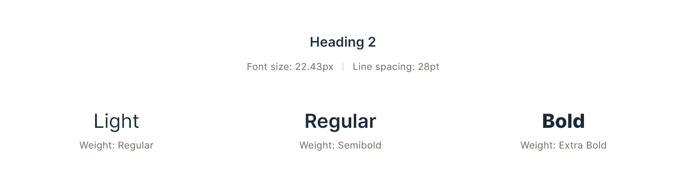
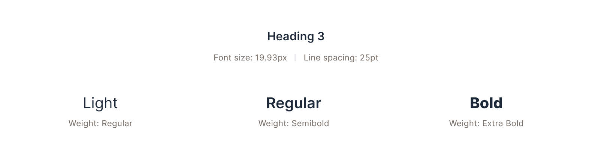
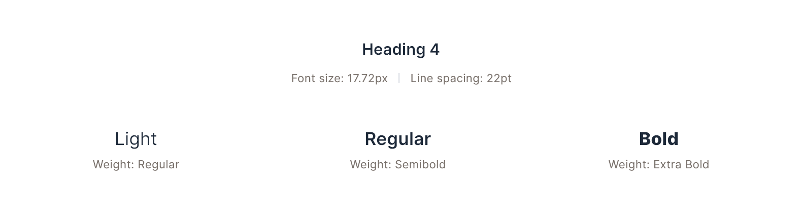
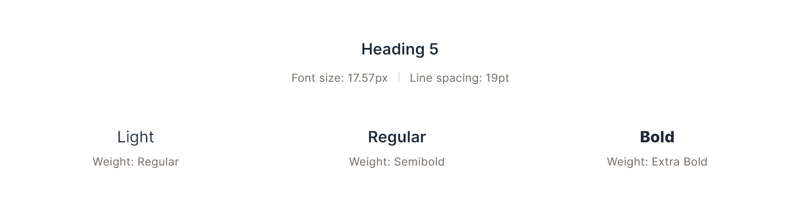
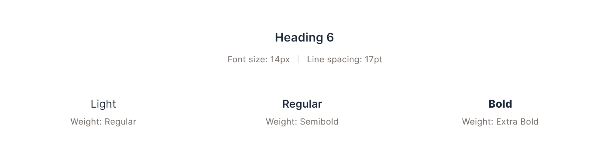
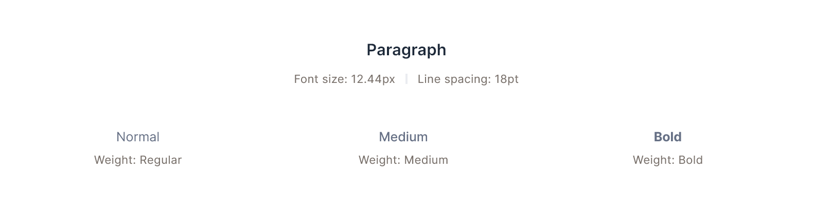
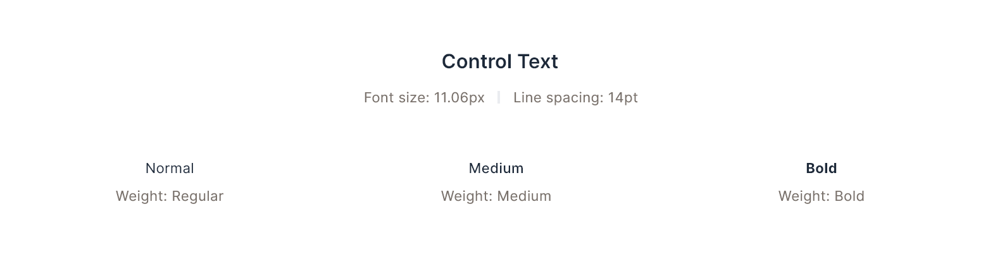
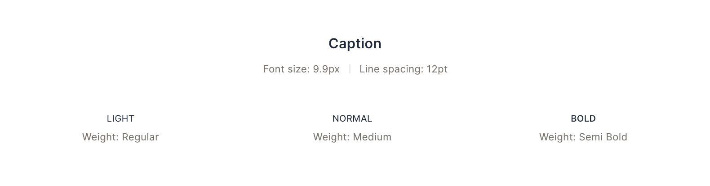

# Typography
The typography system is one of the most foundational parts of any interface design. This typography system is using `Inter` as it's base font. Inter is a free and open-source font for any use.
----
[!ref target="blank" icon="download" text="Download Inter Font"](https://github.com/rsms/inter/releases/download/v3.19/Inter-3.19.zip)

----------

## Using Type
##### TLDR
It's mostly determined initially by line length, then by importance.

#### Title Case for short stuff
Buttons shouldn't be a sentence, so they may or may not use sentence case. Badge's shouldn't be a sentence long, so they shouldn't be sentence case.

#### Sentence case when lots of words go together
If you’re saying an actual sentence, use sentence case. This means descriptions, and details mostly. If you’re describing something after showing it and “titling” it in some way, then use sentence case.

#### For example
You have an input field. The top label should be set in Title Case, and the placeholder and any description text should be set in sentence case. **Do:** Remove Asset, Export Data **Do not** Remove asset, REMOVE ASSET, remove asset

&nbsp;

## Type Weights
There are 5 type weight used from Inter font:
1. Regular
2. Medium
3. Semi Bold
4. Bold
5. Extra Bold

&nbsp;

## Type Sizes
We have defined nine sizes of the font in the catalog. Our baseline is 14px, and our smallest size is ALL CAPS 9.9px. There will be instances where medium and micro font size is required, which has not been accounted for in common at this time.

Inter provides a variable font file which can accommodate any size, style and weight of the font on the go. This can also reduce the page load times and further reinforce UI patterns.

Sizes are generated using [Type-Scale](https://type-scale.com/?size=14&scale=1.125&text=A%20Visual%20Type%20Scale&font=Inter&fontweight=400&bodyfont=body_font_default&bodyfontweight=400&lineheight=1.75&backgroundcolor=%23ffffff&fontcolor=%23000000&preview=false).

| Name | Font Size | Kerning | Line Height |
| --- | --- | --- | --- | --- |
| Heading 1 | `25.23px` | `0pt` | `30pt` |
| Heading 2 | `22.43px` | `0pt` | `28pt` |
| Heading 3 | `19.93px` | `0pt` | `25pt` |
| Heading 4 | `17.72px` | `0pt` | `22pt` |
| Heading 5 | `15.54px` | `0pt` | `19pt` |
| Heading 6 | `14px` | `0pt` | `17pt` |
| Paragraph | `12.44px` | `0pt` | `18pt` |
| Control Text | `11.06px` | `20pt` | `14pt` |
| Caption | `9.9px` | `30pt` | `12pt` |

=== :icon-dot: Heading 1
||| Font Size
`25.25px`
||| Kerning
`0pt`
||| Line Height
`30pt`
||| Default Color
`Gray/800`
|||

----

| Variation | Font Weight |
| --- | --- |
| Light | `Regular` |
| Regular (Default) | `Semi Bold` |
| Bold | `Extra Bold` |

==- :icon-dot: Heading 2
||| Font Size
`22.43px`
||| Kerning
`0pt`
||| Line Height
`28pt`
||| Default Color
`Gray/800`
|||

----

| Variation | Font Weight |
| --- | --- |
| Light | `Regular` |
| Regular (Default) | `Semi Bold` |
| Bold | `Extra Bold` |

==- :icon-dot: Heading 3
||| Font Size
`19.93px`
||| Kerning
`0pt`
||| Line Height
`25pt`
||| Default Color
`Gray/800`
|||

----

| Variation | Font Weight |
| --- | --- |
| Light | `Regular` |
| Regular (Default) | `Semi Bold` |
| Bold | `Extra Bold` |

==- :icon-dot: Heading 4
||| Font Size
`17.72px`
||| Kerning
`0pt`
||| Line Height
`22pt`
||| Default Color
`Gray/800`
|||

----

| Variation | Font Weight |
| --- | --- |
| Light | `Regular` |
| Regular (Default) | `Semi Bold` |
| Bold | `Extra Bold` |

==- :icon-dot: Heading 5
||| Font Size
`15.57px`
||| Kerning
`0pt`
||| Line Height
`19pt`
||| Default Color
`Gray/800`
|||

----

| Variation | Font Weight |
| --- | --- |
| Light | `Regular` |
| Regular (Default) | `Semi Bold` |
| Bold | `Extra Bold` |

==- :icon-dot: Heading 6
||| Font Size
`14px`
||| Kerning
`0pt`
||| Line Height
`17pt`
||| Default Color
`Gray/800`
|||

----

| Variation | Font Weight |
| --- | --- |
| Light | `Regular` |
| Regular (Default) | `Semi Bold` |
| Bold | `Extra Bold` |

==- :icon-dot: Paragraph
||| Font Size
`12.44px`
||| Kerning
`0pt`
||| Line Height
`18pt`
||| Default Color
`Gray/600`
|||

----

| Variation | Font Weight |
| --- | --- |
| Normal (Default) | `Regular` |
| Medium | `Medium` |
| Bold | `Bold` |

==- :icon-dot: Control Text
||| Font Size
`11.06px`
||| Kerning
`20pt`
||| Line Height
`14pt`
||| Default Color
`Gray/800`
|||

----

| Variation | Font Weight |
| --- | --- |
| Normal (Default) | `Regular` |
| Medium | `Medium` |
| Bold | `Bold` |

==- :icon-dot: Caption
||| Font Size
`9.9px`
||| Kerning
`30pt`
||| Line Height
`12pt`
||| Default Color
`Gray/800`
|||

----

| Variation | Font Weight |
| --- | --- |
| Light | `Regular` |
| Normal (Default) | `Medium` |
| Bold | `Semi Bold` |

===